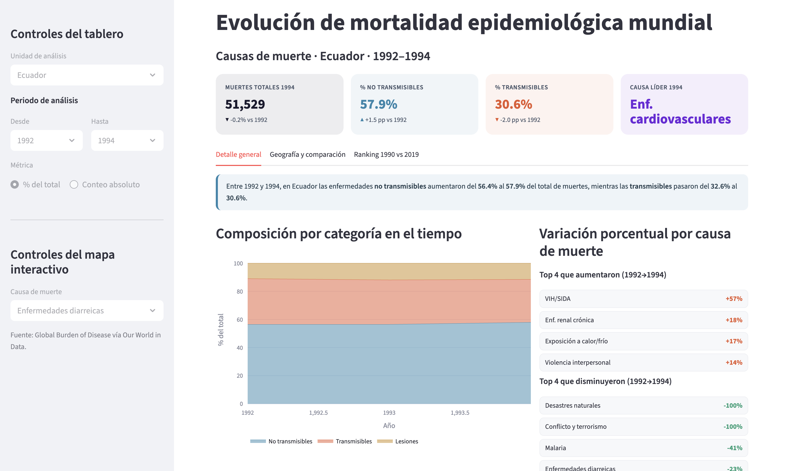

# The Global Epidemiological Transition (1990–2019)

An interactive **data-storytelling dashboard** that shows how the world's causes of death shifted from communicable diseases toward non-communicable ones over three decades — and how that shift is far from uniform across countries.

Built with **Streamlit + Plotly** for a Data Visualization course project.

> In 1990, communicable diseases accounted for ~33% of global deaths. By 2019, non-communicable diseases made up **77%** of all deaths worldwide. This dashboard makes that transition — and its inequalities — readable at a glance.

---

## Preview

> 

```
assets/
  dashboard.png        # full dashboard
  kpis.png             # KPI cards
  trend.png            # cause trend lines
```

---

## Features

- **Styled KPI cards** with borders, color accents, icons, and change-vs-baseline indicators.
- **Tab 1 — Overview & Trends:** dynamic insight callout, stacked-area composition over time, a "biggest movers" panel, and a multi-select cause-trend line chart.
- **Tab 2 — Geography & Comparison:** a choropleth world map for any cause + 100% stacked bars to compare mortality profiles across entities.
- **Tab 3 — Ranking 1990 vs 2019:** a dumbbell chart that ranks the leading causes and connects both years to show direction and size of change.
- **Smart controls:** entity selector, *From / To* year pickers, cause selector for the map, and a count / percentage toggle.
- **Consistent semantic color scheme** (blue = non-communicable, coral = communicable, amber = injuries).

---

##  Dataset

`annual_deaths_by_causes.csv` — annual estimated deaths by cause and entity.

- **Source:** IHME — Global Burden of Disease (GBD), distributed via [Our World in Data](https://ourworldindata.org/causes-of-death). Original Kaggle mirror: [World Deaths and Causes (1990–2019)](https://www.kaggle.com/datasets/madhurpant/world-deaths-and-causes-1990-2019).
- **Shape:** 7,273 rows × 35 columns.
- **Time span:** 1990–2019 (30 years).
- **Entities:** 261 (≈217 countries/territories with ISO-3 codes + 44 aggregates such as `World`, WHO regions, and World Bank income groups).
- **Causes:** 31 cause-of-death columns (counts ≥ 0), e.g. cardiovascular diseases, neoplasms, HIV/AIDS, malaria, tuberculosis, neonatal disorders, road injuries.

### Original attributes
| Attribute | Abstract type | Cardinality / Range |
|---|---|---|
| `country` | Categorical | 261 categories |
| `code` | Categorical | ~217 ISO-3 + nulls (1,067 nulls) |
| `year` | Ordered (quantitative) | 1990 – 2019 |
| 31 cause columns | Quantitative (ratio) | ≥ 0 |

---

##  Data preprocessing & derived attributes

Cleaning steps performed in the app:

- Separate **countries from aggregates** via an `es_agregado` flag (`code` is null *or* starts with `OWID_`, which covers `World`, `USSR`, `Yugoslavia`, `Czechoslovakia`, `Kosovo`).
- Handle **missing values** (433 nulls per cause column, concentrated in some aggregates).
- Drop the `terrorism` column from totals — it overlaps with `conflict_and_terrorism` (avoids double counting) and is very sparse (4,382 nulls).
- Normalize column names and map them to human-readable labels.

Derived attributes created for the visualizations:

| Derived attribute | Abstract type | Range / Cardinality | Use |
|---|---|---|---|
| `total_deaths` | Quantitative (ratio) | 0 – 54,394,314 | Row total; basis for all shares |
| `pct_<cause>` | Quantitative (0–100%) | 0 – 100% | Per-cause share (31 new columns); enables fair cross-country comparison |
| `broad_category` | Categorical (3) | Non-communicable / Communicable / Injuries | GBD grouping for color & area chart |
| `leading_cause` | Categorical | 11 observed categories | Highest-count cause per row |
| `pct_change_90_19` | Quantitative (%) | wide (small-base outliers) | Change 2019 vs 1990 per cause |

---

## Tasks (abstract → domain)

Following the Brehmer & Munzner task typology:

| Domain question | Abstract task | Supporting view |
|---|---|---|
| How did the composition of deaths change globally? | Discover / Summarize trend over time | Stacked area |
| How does a high-income country's profile differ from a low-income one? | Compare items | 100% stacked bars |
| Where is malaria (or HIV) geographically concentrated? | Locate / Explore spatial pattern | Choropleth map |
| Which causes lead, and how did their magnitude and rank change? | Rank + Compare two states | Dumbbell chart |

---

## Getting started

### Requirements
- Python 3.9+
- `streamlit`, `pandas`, `numpy`, `plotly`

### Install & run
```bash
# clone
git clone https://github.com/<your-user>/epidemiological-transition-dashboard.git
cd epidemiological-transition-dashboard

# (optional) virtual environment
python -m venv .venv && source .venv/bin/activate   # Windows: .venv\Scripts\activate

# install
pip install -r requirements.txt

# make sure annual_deaths_by_causes.csv is in the project root, then:
streamlit run app.py
```

`requirements.txt`:
```
streamlit
pandas
numpy
plotly
```

---

## Project structure
```
epidemiological-transition-dashboard/
├── app.py                        # Streamlit dashboard
├── annual_deaths_by_causes.csv   # dataset (IHME GBD via OWID)
├── requirements.txt
├── assets/                       # screenshots / GIFs
└── README.md
```

---

##  Design decisions (short version)

- **Stacked area** shows total *and* composition at once — magnitude is read by length/height, a high-precision channel, unlike animated pie charts (angle/area).
- **Choropleth + percentage** answers the spatial "where?" using prior geographic knowledge; the percentage (not raw counts) prevents large-population countries from dominating the map.
- **Dumbbell** uses position on a shared axis (the most precise channel for magnitude) and a connecting line so the change between years is read directly, without mental subtraction.
- **Semantic, colorblind-aware palette** reinforces meaning and follows the Our World in Data convention.

---

##  References

- Munzner, T. (2014). *Visualization Analysis and Design.* CRC Press.
- Brehmer, M., & Munzner, T. (2013). *A Multi-Level Typology of Abstract Visualization Tasks.* IEEE TVCG.
- Cleveland, W. S., & McGill, R. (1984). *Graphical Perception.* JASA.
- Ritchie, H., & Roser, M. *Causes of Death.* Our World in Data.
- Institute for Health Metrics and Evaluation (IHME). *Global Burden of Disease Study.*

---

##  License

Released under the MIT License. The underlying data belongs to IHME / Our World in Data under their respective terms.

##  Author

Created for the **Data Visualization** course . Maintainer: Gema Zambrano and Emilio Quimis.
